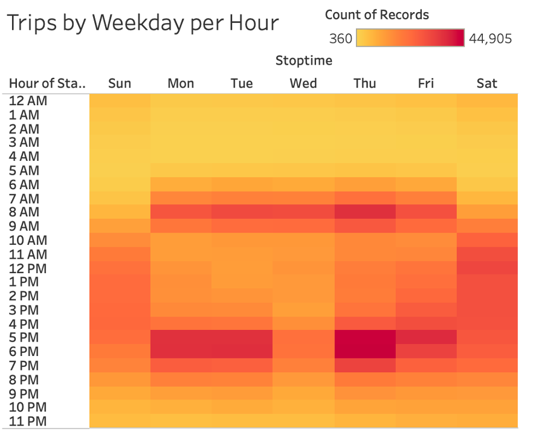
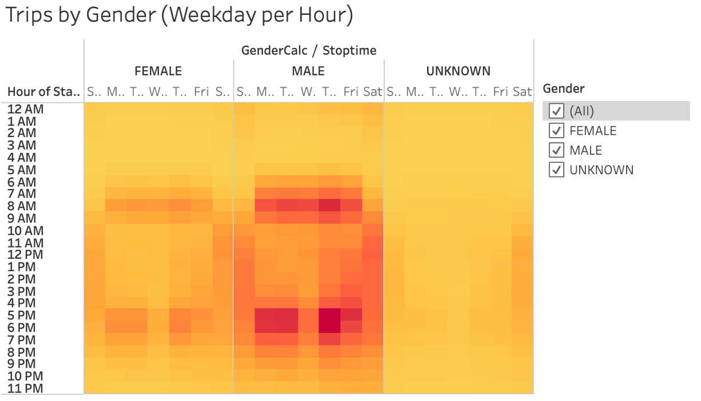
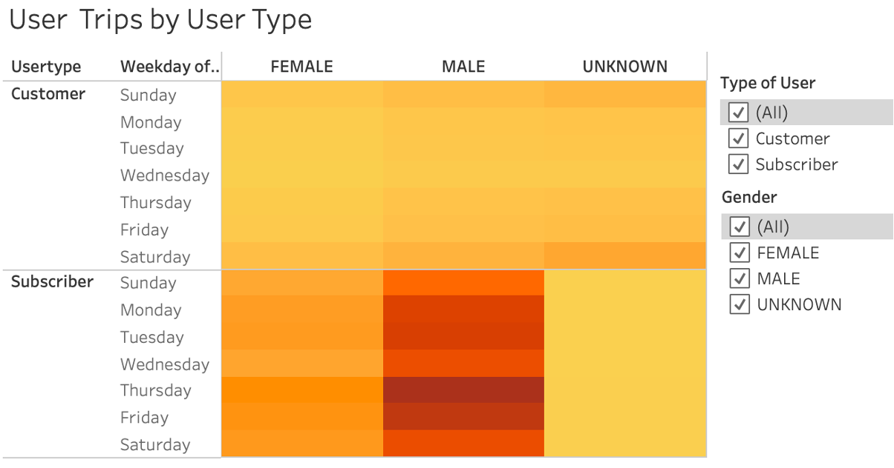

# NY Citi Bike Sharing Analysis

## Overview
### Purpose
In this project, we have analyzed data for the usage of the NYC Citi Bike Sharing program, using data found at the following source: [Citi Bike NYC](https://ride.citibikenyc.com/system-data). We are using this data to determine what factors would influence our desicion to open a bike sharing business in Des Moines.

## Results

### Tableau Analysis
[Link to Dashboard](https://public.tableau.com/views/NYCCitiBikesChallenge_16433998963730/CitiBike?:language=en-US&:display_count=n&:origin=viz_share_link)

### Visualizations

#### Checkout Times

- Most bikes are checked out for a length of 5 minutes.

#### Checkout Times by Gender

- A greater amount of rides were checked out by male users rather than female or users of unknown gender.

#### Checkout Locations in Manhattan and Surrounding Burroughs

- This visualization shows the starting locations for bike checkout. A majority of Citi Bike rentals started in Manhattan.

#### August Peak Hours

- Bike usage was greatest between the hours of 5:00 pm and 7:00 pm, during commuting hours, with lowest usage between 2:00 am and 5:00 am.

#### Trips by Weekday per Hour

- This heatmap shows that a greater proportion of trips fall in the early morning and in the evening on weekdays, which may be due to work-related commuting, while weekends see a greater number of trips during the later morning and consistently through the afternon, which may be due to leisure.

#### Trips by Weekday and Gender

- This heatmap shows us that it is fairly consistently between male and female users when the most common bike renting and riding times are, however, we also note that male users rent bikes at far greater rates than both female and users of unknown gender.

#### Trips by User Type

- This heatmap shows us that subscribers to the bike sharing service use bikes at much greater levels than customers who are not subscribers. We can also see that bikes are rented at far greater quantities on Thursday, although Thursday is a weekday and not weekend and therefore this would be an interesting piece of information to explore.

## Summary
When taking a look at this data in conjunction with planning for a bike sharing service in Des Moines, the following data is the most relevant:
- Bikes are used by commuters on weekday mornings and afternoons. Prepare for a greater number of bikes at popular locations or at transit hubs during these times.
- Bikes are used more by male users than female. How do we encourage more female users? Taking a look at safety would be important.
- Weekend bike users ride in the late morning through the early evening and do not follow a commuting schedule, which leads me to believe that weekend rides are for enjoyment rather than to get to a specific place at a specific time. Creating two separate maps for weekday start locations and weekend start locations would help us determine where in NY bikes are rented and if there is a difference between locations on weekdays and weekends. Then we can decide where in Des Moines to offer bikes for rent.
- Collecting bikes for refurbishment would be best to do between the hours of 2:00 am and 5:00 am, as bikes are used least at these hours. However, there may still be a difference in weekday/weekend usage at these hours, which would be wise to compare.
