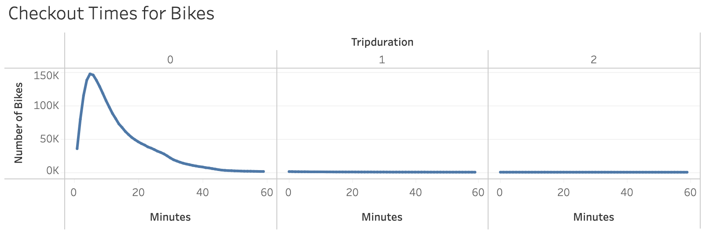
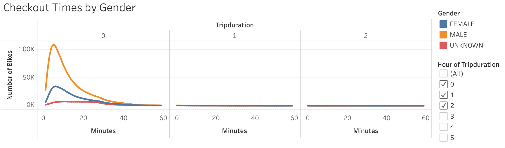
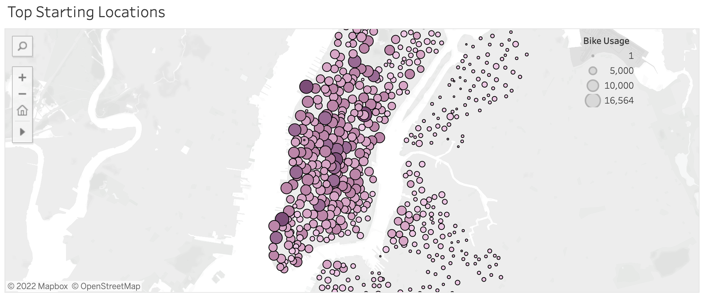
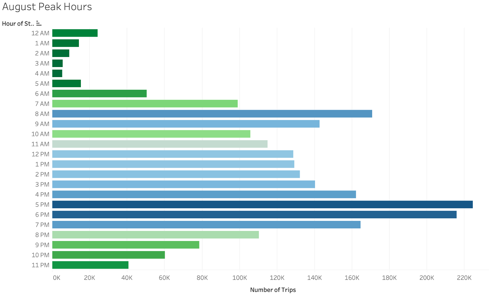

# NY Citi Bike Sharing Analysis

## Overview
### Purpose
In this project, we have analyzed data for the usage of the NYC Citi Bike Sharing program, using data found at the following source: [link to data](https://ride.citibikenyc.com/system-data "NYC Citi Bike Sharing Data). We are using this data to determine how we would open a bike-sharing business in Des Moines.

## Results

### Tableau Analysis
[link to dashboard](https://public.tableau.com/views/NYCCitiBikesChallenge_16433998963730/CitiBike?:language=en-US&:display_count=n&:origin=viz_share_link "Link to Dashboard")

### Visualizations

#### Checkout Times

- Most bikes are checked out for a length of 5 minutes.

#### Checkout Times by Gender

- A greater amount of rides were checked out by male users rather than female or users of unknown gender.

#### Checkout Locations in Manhattan and Surrounding Burroughs

- This visualization shows the starting locations for bike checkout. A majority of Citi Bike rentals started in Manhattan.

#### August Peak Hours

- Bike usage was greatest between the hours of 5:00 pm and 7:00 pm, with lowest usage between 2:00 am and 5:00 am.

